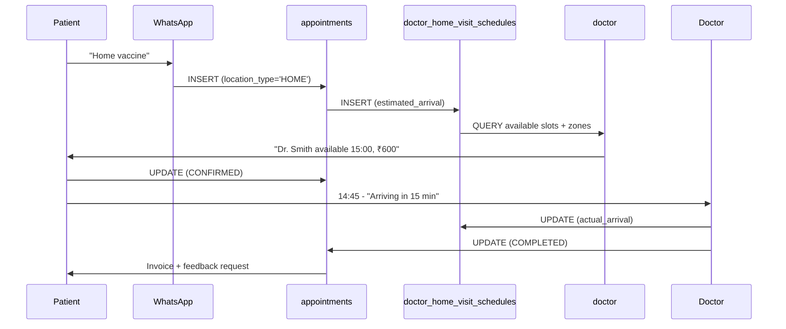

# Multi-Clinic Architecture Design

**Date:** September 14, 2026  
**Status:** Design Phase - Ready for Implementation  

---

## 🏥 Core Concept

Enable a **single Supabase project** to serve **multiple clinics** with:
- ✅ Independent service configuration per clinic
- ✅ Clinic-wide and doctor-specific operating hours
- ✅ Holiday management
- ✅ Service type toggling (diagnostic, home collection, vaccines, etc.)
- ✅ Service location options (clinic visit, home visit, etc.)
- ✅ Data isolation via `clinic_id`

---

## 📋 New Table Structure (15 Tables Total)

### 1. **clinics** (Base Configuration)
```sql
CREATE TABLE clinics (
  id UUID PRIMARY KEY DEFAULT gen_random_uuid(),
  clinic_code TEXT UNIQUE NOT NULL,           -- ABC_CLINIC, XYZ_CLINIC
  name VARCHAR(255) NOT NULL,
  phone VARCHAR(20) NOT NULL,
  email VARCHAR(255),
  address TEXT,
  city VARCHAR(100),
  country VARCHAR(100),
  
  -- Configuration flags
  is_active BOOLEAN DEFAULT true,
  timezone VARCHAR(50) DEFAULT 'Asia/Kolkata',
  
  -- Service availability
  enable_home_collection BOOLEAN DEFAULT true,
  enable_diagnostic_center BOOLEAN DEFAULT true,
  enable_doctor_consultations BOOLEAN DEFAULT true,
  
  -- WhatsApp integration
  whatsapp_phone_number VARCHAR(20),
  whatsapp_business_account_id VARCHAR(100),
  
  -- Billing
  subscription_tier VARCHAR(50) DEFAULT 'PRO',  -- STARTER, PRO, ENTERPRISE
  billing_email VARCHAR(255),
  
  created_at TIMESTAMP DEFAULT NOW(),
  updated_at TIMESTAMP DEFAULT NOW(),
  
  INDEXES: clinic_code, is_active, created_at
);
```

---

### 2. **clinic_services** (Service Configuration)
```sql
CREATE TABLE clinic_services (
  id UUID PRIMARY KEY DEFAULT gen_random_uuid(),
  clinic_id UUID NOT NULL REFERENCES clinics(id),
  service_type_id UUID NOT NULL REFERENCES service_types(id),
  
  -- Enable/disable per clinic
  is_enabled BOOLEAN DEFAULT true,
  
  -- Configuration
  min_advance_booking_hours INT DEFAULT 2,      -- Minimum hours ahead to book
  max_advance_booking_days INT DEFAULT 30,      -- Maximum days ahead to book
  requires_payment BOOLEAN DEFAULT false,
  base_price DECIMAL(10, 2),
  
  -- Availability
  available_monday BOOLEAN DEFAULT true,
  available_tuesday BOOLEAN DEFAULT true,
  available_wednesday BOOLEAN DEFAULT true,
  available_thursday BOOLEAN DEFAULT true,
  available_friday BOOLEAN DEFAULT true,
  available_saturday BOOLEAN DEFAULT true,
  available_sunday BOOLEAN DEFAULT false,
  
  created_at TIMESTAMP DEFAULT NOW(),
  updated_at TIMESTAMP DEFAULT NOW(),
  
  UNIQUE(clinic_id, service_type_id),
  INDEXES: clinic_id, service_type_id, is_enabled
);
```

---

### 3. **service_types** (Global Service Catalog)
```sql
CREATE TABLE service_types (
  id UUID PRIMARY KEY DEFAULT gen_random_uuid(),
  code VARCHAR(50) UNIQUE NOT NULL,             -- BLOOD_TEST, VACCINE, CONSULTATION, etc.
  name VARCHAR(255) NOT NULL,
  description TEXT,
  category VARCHAR(100),                        -- DIAGNOSTIC, VACCINATION, CONSULTATION, HOME_SERVICE
  
  -- Service-specific config
  requires_doctor BOOLEAN DEFAULT false,        -- CONSULTATION needs doctor, BLOOD_TEST doesn't
  is_home_serviceable BOOLEAN DEFAULT false,    -- Can be done at home?
  is_clinic_serviceable BOOLEAN DEFAULT true,   -- Can be done at clinic?
  
  typical_duration_minutes INT DEFAULT 30,
  requires_sample_collection BOOLEAN DEFAULT false,
  
  created_at TIMESTAMP DEFAULT NOW(),
  updated_at TIMESTAMP DEFAULT NOW(),
  
  INDEXES: code, category
);
```

---

### 4. **clinic_operating_hours** (Clinic-Wide Timings)
```sql
CREATE TABLE clinic_operating_hours (
  id UUID PRIMARY KEY DEFAULT gen_random_uuid(),
  clinic_id UUID NOT NULL REFERENCES clinics(id),
  
  day_of_week INT NOT NULL,                     -- 1=Monday, 7=Sunday
  opening_time VARCHAR(5) NOT NULL,             -- "09:00"
  closing_time VARCHAR(5) NOT NULL,             -- "18:00"
  lunch_start_time VARCHAR(5),                  -- "13:00" (optional)
  lunch_end_time VARCHAR(5),                    -- "14:00" (optional)
  
  is_active BOOLEAN DEFAULT true,
  
  created_at TIMESTAMP DEFAULT NOW(),
  updated_at TIMESTAMP DEFAULT NOW(),
  
  UNIQUE(clinic_id, day_of_week),
  INDEXES: clinic_id, day_of_week
);
```

---

### 5. **clinic_holidays** (Clinic Closures)
```sql
CREATE TABLE clinic_holidays (
  id UUID PRIMARY KEY DEFAULT gen_random_uuid(),
  clinic_id UUID NOT NULL REFERENCES clinics(id),
  
  holiday_date DATE NOT NULL,
  holiday_name VARCHAR(255),                    -- "Diwali", "New Year", etc.
  reason TEXT,
  
  -- Partial closure option
  is_full_closure BOOLEAN DEFAULT true,
  partial_opening_from VARCHAR(5),              -- Optional: Open for emergencies
  partial_opening_to VARCHAR(5),
  
  created_at TIMESTAMP DEFAULT NOW(),
  
  UNIQUE(clinic_id, holiday_date),
  INDEXES: clinic_id, holiday_date
);
```

---

### 6. **doctors** (Clinic-Specific Doctors)
```sql
CREATE TABLE doctors (
  id UUID PRIMARY KEY DEFAULT gen_random_uuid(),
  clinic_id UUID NOT NULL REFERENCES clinics(id),
  
  doctor_code TEXT NOT NULL,                    -- D001, D002 (unique per clinic)
  name VARCHAR(255) NOT NULL,
  phone VARCHAR(20),
  email VARCHAR(255),
  specialization VARCHAR(100),
  
  -- Qualifications
  license_number VARCHAR(50),
  is_verified BOOLEAN DEFAULT false,
  
  -- Status
  is_active BOOLEAN DEFAULT true,
  status VARCHAR(20) DEFAULT 'AVAILABLE',       -- AVAILABLE, LEAVE, INACTIVE
  
  created_at TIMESTAMP DEFAULT NOW(),
  updated_at TIMESTAMP DEFAULT NOW(),
  
  UNIQUE(clinic_id, doctor_code),
  INDEXES: clinic_id, is_active
);
```

---

### 7. **doctor_operating_hours** (Doctor-Specific Timings)
```sql
CREATE TABLE doctor_operating_hours (
  id UUID PRIMARY KEY DEFAULT gen_random_uuid(),
  clinic_id UUID NOT NULL REFERENCES clinics(id),
  doctor_id UUID NOT NULL REFERENCES doctors(id),
  
  day_of_week INT NOT NULL,
  opening_time VARCHAR(5) NOT NULL,
  closing_time VARCHAR(5) NOT NULL,
  lunch_start_time VARCHAR(5),
  lunch_end_time VARCHAR(5),
  
  -- Optional: Different slot duration than clinic default
  slot_duration_minutes INT DEFAULT 30,
  
  is_active BOOLEAN DEFAULT true,
  
  created_at TIMESTAMP DEFAULT NOW(),
  updated_at TIMESTAMP DEFAULT NOW(),
  
  UNIQUE(doctor_id, day_of_week),
  INDEXES: clinic_id, doctor_id, day_of_week
);
```

---

### 8. **doctor_leaves** (Doctor Absences)
```sql
CREATE TABLE doctor_leaves (
  id UUID PRIMARY KEY DEFAULT gen_random_uuid(),
  clinic_id UUID NOT NULL REFERENCES clinics(id),
  doctor_id UUID NOT NULL REFERENCES doctors(id),
  
  leave_start_date DATE NOT NULL,
  leave_end_date DATE NOT NULL,
  leave_type VARCHAR(50),                       -- SICK, VACATION, EMERGENCY, RESEARCH
  reason TEXT,
  
  status VARCHAR(20) DEFAULT 'APPROVED',        -- PENDING, APPROVED, REJECTED, CANCELLED
  approved_by UUID REFERENCES doctors(id),      -- Admin/Manager who approved
  
  created_at TIMESTAMP DEFAULT NOW(),
  updated_at TIMESTAMP DEFAULT NOW(),
  
  INDEXES: clinic_id, doctor_id, leave_start_date, leave_end_date, status
);
```

---

### 9. **doctor_services** (Services Each Doctor Provides)
```sql
CREATE TABLE doctor_services (
  id UUID PRIMARY KEY DEFAULT gen_random_uuid(),
  clinic_id UUID NOT NULL REFERENCES clinics(id),
  doctor_id UUID NOT NULL REFERENCES doctors(id),
  service_type_id UUID NOT NULL REFERENCES service_types(id),
  
  -- Service-specific configuration
  is_enabled BOOLEAN DEFAULT true,
  can_do_clinic_visit BOOLEAN DEFAULT true,        -- Doctor can provide this at clinic
  can_do_home_visit BOOLEAN DEFAULT false,         -- Doctor can visit home for this
  
  -- Pricing (override base price)
  clinic_price DECIMAL(10, 2),                     -- Price at clinic
  home_visit_price DECIMAL(10, 2),                 -- Price for home visit (usually higher)
  
  -- Availability
  min_consultation_minutes INT DEFAULT 30,         -- Typical consultation duration
  
  created_at TIMESTAMP DEFAULT NOW(),
  updated_at TIMESTAMP DEFAULT NOW(),
  
  UNIQUE(doctor_id, service_type_id),
  INDEXES: clinic_id, doctor_id, service_type_id
);
```

---

### 10. **doctor_home_visit_hours** (Doctor's Home Visit Schedule)
```sql
CREATE TABLE doctor_home_visit_hours (
  id UUID PRIMARY KEY DEFAULT gen_random_uuid(),
  clinic_id UUID NOT NULL REFERENCES clinics(id),
  doctor_id UUID NOT NULL REFERENCES doctors(id),
  
  day_of_week INT NOT NULL,                        -- 1=Monday, 7=Sunday
  opening_time VARCHAR(5) NOT NULL,                -- "10:00" (may differ from clinic hours)
  closing_time VARCHAR(5) NOT NULL,                -- "19:00"
  
  -- Travel buffers
  min_travel_time_minutes INT DEFAULT 15,          -- Time between appointments for travel
  buffer_after_appointment_minutes INT DEFAULT 10, -- Prep time after home visit
  
  max_home_visits_per_day INT DEFAULT 8,           -- Cap on daily home visits
  
  is_active BOOLEAN DEFAULT true,
  
  created_at TIMESTAMP DEFAULT NOW(),
  updated_at TIMESTAMP DEFAULT NOW(),
  
  UNIQUE(doctor_id, day_of_week),
  INDEXES: clinic_id, doctor_id, day_of_week
);
```

---

### 11. **doctor_service_zones** (Geographic Areas Each Doctor Serves)
```sql
CREATE TABLE doctor_service_zones (
  id UUID PRIMARY KEY DEFAULT gen_random_uuid(),
  clinic_id UUID NOT NULL REFERENCES clinics(id),
  doctor_id UUID NOT NULL REFERENCES doctors(id),
  
  -- Zone identification
  zone_name VARCHAR(255) NOT NULL,                 -- "North Delhi", "South Delhi", etc.
  zone_code VARCHAR(50),                           -- "NORTH_DELHI", "SOUTH_DELHI"
  
  -- Geographic boundaries (polygon for advanced geofencing)
  -- Simple approach: center point + radius
  center_latitude DECIMAL(10, 8),
  center_longitude DECIMAL(11, 8),
  service_radius_km INT DEFAULT 5,                 -- Service within 5 km radius
  
  -- Postal codes (simple approach)
  postal_codes TEXT,                               -- "110001,110002,110003" (comma-separated)
  
  is_active BOOLEAN DEFAULT true,
  
  created_at TIMESTAMP DEFAULT NOW(),
  updated_at TIMESTAMP DEFAULT NOW(),
  
  INDEXES: clinic_id, doctor_id, zone_code
);
```

---

### 12. **doctor_home_visit_schedules** (Track Doctor's Daily Route)
```sql
CREATE TABLE doctor_home_visit_schedules (
  id UUID PRIMARY KEY DEFAULT gen_random_uuid(),
  clinic_id UUID NOT NULL REFERENCES clinics(id),
  doctor_id UUID NOT NULL REFERENCES doctors(id),
  appointment_id TEXT NOT NULL REFERENCES appointments(id),
  
  -- Planning
  scheduled_visit_order INT,                       -- 1st, 2nd, 3rd home visit on this day
  estimated_arrival_time TIMESTAMP,                -- Estimated time doctor will reach
  estimated_departure_time TIMESTAMP,              -- Estimated when doctor leaves
  
  -- Real-time tracking
  actual_arrival_time TIMESTAMP,                   -- When doctor actually arrived
  actual_departure_time TIMESTAMP,                 -- When doctor actually left
  doctor_arrived_notification_sent BOOLEAN DEFAULT false,  -- Notified patient
  
  -- Route optimization
  visit_distance_km DECIMAL(10, 2),                -- Distance from clinic/previous visit
  visit_travel_time_minutes INT,                   -- Actual travel time taken
  
  -- Notes
  visit_notes TEXT,                                -- Doctor's notes from home visit
  complications TEXT,                              -- Any issues during visit
  
  created_at TIMESTAMP DEFAULT NOW(),
  updated_at TIMESTAMP DEFAULT NOW(),
  
  INDEXES: clinic_id, doctor_id, scheduled_visit_order, estimated_arrival_time
);
```

---

### 13. **service_locations** (Where Services Can Be Done)
```sql
CREATE TABLE service_locations (
  id UUID PRIMARY KEY DEFAULT gen_random_uuid(),
  clinic_id UUID NOT NULL REFERENCES clinics(id),
  service_type_id UUID NOT NULL REFERENCES service_types(id),
  
  location_type VARCHAR(50) NOT NULL,           -- CLINIC, HOME, DIAGNOSTICS_CENTER, MOBILE_VAN
  location_name VARCHAR(255),                   -- "Main Clinic", "Home Service", etc.
  address TEXT,
  city VARCHAR(100),
  
  -- Availability for this location
  is_available BOOLEAN DEFAULT true,
  available_from_time VARCHAR(5),               -- "06:00" (e.g., early morning home collection)
  available_to_time VARCHAR(5),                 -- "20:00"
  
  -- Pricing (can differ by location)
  price_override DECIMAL(10, 2),                -- Override service_types base price
  
  created_at TIMESTAMP DEFAULT NOW(),
  updated_at TIMESTAMP DEFAULT NOW(),
  
  UNIQUE(clinic_id, service_type_id, location_type),
  INDEXES: clinic_id, service_type_id, location_type
);
```

---

### 14. **appointments** (Enhanced - Clinic-Aware + Doctor Home Visits)
```sql
CREATE TABLE appointments (
  id TEXT PRIMARY KEY,                          -- APT_20260914_abc123 (clinic-prefixed)
  clinic_id UUID NOT NULL REFERENCES clinics(id),
  doctor_id UUID REFERENCES doctors(id),        -- NULL for non-doctor services
  patient_phone VARCHAR(20) NOT NULL,
  patient_name VARCHAR(255),
  
  -- What service
  service_type_id UUID NOT NULL REFERENCES service_types(id),
  service_location_id UUID REFERENCES service_locations(id),
  
  -- When & Where
  appointment_date DATE NOT NULL,
  appointment_time VARCHAR(5) NOT NULL,         -- HH:MM
  duration_minutes INT DEFAULT 30,
  location_type VARCHAR(50),                    -- CLINIC, HOME, DIAGNOSTIC_CENTER, MOBILE_VAN
  
  -- Address (for home appointments)
  service_address TEXT,
  service_latitude DECIMAL(10, 8),
  service_longitude DECIMAL(11, 8),
  service_zone_id UUID REFERENCES doctor_service_zones(id),  -- For routing
  
  -- Status tracking
  status VARCHAR(20) DEFAULT 'CONFIRMED',       -- CONFIRMED, COMPLETED, NO_SHOW, CANCELLED, RESCHEDULED
  cancellation_reason TEXT,
  rescheduled_from UUID,                        -- Reference to previous appointment
  
  -- Doctor Home Visit Tracking (if location_type = HOME and doctor_id is set)
  doctor_home_visit_schedule_id UUID REFERENCES doctor_home_visit_schedules(id),
  estimated_doctor_arrival TIMESTAMP,           -- When doctor expected to arrive
  actual_doctor_arrival TIMESTAMP,              -- When doctor actually arrived
  actual_doctor_departure TIMESTAMP,            -- When doctor left
  doctor_arrival_notification_sent BOOLEAN DEFAULT false,
  
  -- Payment
  amount DECIMAL(10, 2),
  payment_status VARCHAR(20) DEFAULT 'PENDING', -- PENDING, COMPLETED, FAILED
  
  notes TEXT,
  created_at TIMESTAMP DEFAULT NOW(),
  updated_at TIMESTAMP DEFAULT NOW(),
  completed_at TIMESTAMP,
  
  INDEXES: clinic_id, doctor_id, patient_phone, appointment_date, status, service_type_id, location_type
);
```

---

### 15. **patients** (Clinic-Agnostic)
```sql
CREATE TABLE patients (
  id UUID PRIMARY KEY DEFAULT gen_random_uuid(),
  phone VARCHAR(20) UNIQUE NOT NULL,            -- Unique globally
  name VARCHAR(255) NOT NULL,
  
  -- Demographics
  gender VARCHAR(20),
  age INT,
  email VARCHAR(255),
  
  -- Medical
  blood_group VARCHAR(10),
  known_allergies TEXT,
  
  -- Stats
  total_appointments INT DEFAULT 0,
  last_appointment_date DATE,
  preferred_clinic_id UUID REFERENCES clinics(id),  -- Default clinic for this patient
  
  created_at TIMESTAMP DEFAULT NOW(),
  updated_at TIMESTAMP DEFAULT NOW(),
  
  INDEXES: phone, email, created_at
);
```

---

### 16. **home_collection_requests** (Enhanced - Multi-Clinic)
```sql
CREATE TABLE home_collection_requests (
  id TEXT PRIMARY KEY,                          -- HC_20260914_abc123
  clinic_id UUID NOT NULL REFERENCES clinics(id),
  patient_phone VARCHAR(20) NOT NULL REFERENCES patients(phone),
  patient_name VARCHAR(255),
  
  -- What service
  service_type_id UUID NOT NULL REFERENCES service_types(id),
  
  -- Where to collect
  collection_address TEXT NOT NULL,
  collection_latitude DECIMAL(10, 8),
  collection_longitude DECIMAL(11, 8),
  
  -- When
  requested_date DATE,
  requested_time_from VARCHAR(5),               -- "10:00"
  requested_time_to VARCHAR(5),                 -- "12:00"
  
  -- Who (assigned)
  assigned_technician_name VARCHAR(255),
  assigned_technician_phone VARCHAR(20),
  
  -- Status
  status VARCHAR(20) DEFAULT 'PENDING',         -- PENDING, ASSIGNED, ON_THE_WAY, COMPLETED, CANCELLED
  expected_arrival_time TIMESTAMP,
  actual_collection_time TIMESTAMP,
  
  notes TEXT,
  created_at TIMESTAMP DEFAULT NOW(),
  updated_at TIMESTAMP DEFAULT NOW(),
  
  INDEXES: clinic_id, patient_phone, status, requested_date
);
```

---

## 🔑 Key Design Changes

### 1. **Clinic Isolation**
- Every table has `clinic_id` foreign key
- Queries always filter by clinic_id
- Data is logically separated per clinic

### 2. **Service Configuration**
- `service_types` - Global service catalog
- `clinic_services` - Which services each clinic offers
- `service_locations` - Where services can be done (clinic, home, diagnostic center)
- Clinics can enable/disable services independently

### 3. **Operating Hours Hierarchy**
```
Clinic Operating Hours (base)
  ↓ (can be overridden by)
Doctor Operating Hours (specific to doctor/day)
  ↓
Appointment scheduling respects both
```

Example: Clinic open 09:00-18:00, but Dr. Smith works 10:00-17:00 → Only 10:00-17:00 available

### 4. **Holiday Management**
- `clinic_holidays` - Clinic-specific closures
- Check before confirming appointment
- Support partial closures (emergency-only)

### 5. **Service Location Flexibility**
```
BLOOD_TEST service can be:
  - CLINIC (at clinic labs)
  - HOME (technician visits home)
  - DIAGNOSTICS_CENTER (partner lab)
  
Each location has:
  - Availability (open 06:00-20:00 for home)
  - Pricing override (may be higher for home)
  - Address/details
```

---

## 🔄 Service Configuration Examples

### Example 1: Multi-Service Clinic (ABC Clinic)
```
✅ Doctor Consultations (9:00-18:00)
✅ Blood Tests - Clinic & Home (6:00-20:00 for home)
✅ Vaccines - Clinic Only (9:00-17:00)
❌ Diagnostic Imaging (disabled)
```

### Example 2: Diagnostic Center (XYZ Diagnostics)
```
✅ Blood Tests - Clinic & Home (7:00-22:00)
✅ Imaging - Clinic Only (9:00-18:00)
❌ Doctor Consultations (disabled)
❌ Vaccines (disabled)
```

### Example 3: Home Service Only (Mobile Collection)
```
✅ Blood Tests - Home Only (6:00-21:00)
✅ Sample Collection - Home Only (6:00-21:00)
❌ Doctor Consultations (disabled)
❌ Clinic visits (disabled)
```

---

## � Doctor Home Visit Workflow

### **Feature Overview**
Doctors can provide services at patient homes with:
- ✅ Separate availability schedule for home visits
- ✅ Geographic zone management (service radius)
- ✅ Real-time doctor location tracking
- ✅ Optimized routing (visit order, travel time)
- ✅ Patient notifications (doctor arriving in 15 minutes)
- ✅ Service-specific pricing (can charge more for home visit)

### **How It Works**

#### **1. Setup Phase (Clinic Admin)**
```
Step 1: Define doctor services
  - Dr. Smith can do: Consultations (clinic + home), Vaccines (home only)
  - Dr. Jones can do: Consultations (clinic only), Blood tests (home + clinic)

Step 2: Set home visit hours
  - Dr. Smith: Mon-Fri 10:00-19:00 (different from clinic 9:00-18:00)
  - Dr. Jones: Mon-Sun 06:00-20:00

Step 3: Define service zones
  - Dr. Smith serves: North Delhi (area code NORTH_DELHI, 5km radius from clinic)
  - Dr. Jones serves: South Delhi, East Delhi (can handle multiple zones)

Step 4: Configure pricing
  - Clinic consultation: ₹500
  - Home visit consultation: ₹750 (higher for convenience)
  - Home vaccine: ₹600
```

#### **2. Patient Booking Phase**
```
Patient: "I want home vaccination"
  ↓
System checks:
  - Is vaccination available for home? (doctor_services.can_do_home_visit = true)
  - Is patient location in service zones? (doctor_service_zones)
  - Is doctor available today? (doctor_home_visit_hours)
  - Is doctor free (other home visits + travel time)? (doctor_home_visit_schedules)
  ↓
System shows:
  - Available doctors
  - Available time slots
  - Price (₹600 for home)
  - ETA from doctor's current location
  ↓
Patient books: Dr. Smith, Today 15:00, North Delhi address
```

#### **3. Scheduling Phase (System)**
```
After booking confirmed:
  1. Create doctor_home_visit_schedule entry
  2. Calculate visit order (1st, 2nd, 3rd home visit today)
  3. Estimate arrival time:
     - Previous home visit end time
     + Travel time from previous location (15 min)
     + Buffer time (10 min)
     = Estimated arrival

Example:
  Dr. Smith's home visits today:
    14:00-14:30: Patient A (Location: South Delhi)
    (travel 15 min + buffer 10 min = 25 min)
    14:55-15:25: Patient B (Location: South Delhi)
    (travel 15 min + buffer 10 min = 25 min)
    15:50-16:20: Patient C (Location: North Delhi)
```

#### **4. Execution Phase (Real-time)**
```
At 14:45:
  - System sends notification: "Dr. Smith arriving at your home in 10 minutes"
  
At 14:55:
  - Dr. Smith confirms arrival (mobile app / WhatsApp)
  - actual_doctor_arrival = 14:55
  - System notifies patient
  
At 15:25:
  - Dr. Smith marks visit complete
  - actual_doctor_departure = 15:25
  - visit_notes = "Patient administered vaccine, no adverse reactions"
  - appointment status = COMPLETED
  - Payment: Mark as completed if prepaid, send invoice if postpaid
```

#### **5. Tracking Phase (Analytics)**
```
After all visits:
  - visit_distance_km: 2.5km (measured from GPS)
  - visit_travel_time_minutes: 12 (actual vs estimated 15)
  - Patient feedback: 5 stars
  
Route optimization:
  - Next week, schedule Patient C earlier in route
  - Reorder visits based on geography
```

### **Database Flow for Home Visit Booking**



### **Example Query: Find Available Home Visit Doctors**

```sql
-- Find doctors available for home vaccine in North Delhi on 2026-09-15

SELECT d.id, d.name, 
       dhs.estimated_arrival_time,
       ds.home_visit_price,
       dz.zone_name,
       COUNT(hv.id) as home_visits_today
FROM doctors d
  JOIN doctor_services ds 
    ON d.id = ds.doctor_id AND ds.service_type_id = 'vaccine' AND ds.can_do_home_visit
  JOIN doctor_home_visit_hours dhh 
    ON d.id = dhh.doctor_id AND dhh.day_of_week = EXTRACT(DOW FROM '2026-09-15')
  LEFT JOIN doctor_service_zones dz 
    ON d.id = dz.doctor_id AND dz.zone_code = 'NORTH_DELHI'
  LEFT JOIN doctor_home_visit_schedules hv 
    ON d.id = hv.doctor_id AND DATE(hv.estimated_arrival_time) = '2026-09-15'
WHERE d.clinic_id = 'ABC_CLINIC'
  AND ds.is_enabled = true
  AND dhh.opening_time <= '15:00' AND dhh.closing_time >= '16:00'
  AND COUNT(hv.id) < dhh.max_home_visits_per_day
GROUP BY d.id, d.name, dhs.estimated_arrival_time, ds.home_visit_price, dz.zone_name
ORDER BY hv.home_visits_today ASC;  -- Show doctors with fewer visits first
```

---

## �📝 Configuration API (Future)

The handlers will query this to determine:

```typescript
// Patient booking flow would check:
const clinicServices = await supabase
  .from('clinic_services')
  .select('*')
  .eq('clinic_id', clinicId)
  .eq('is_enabled', true);
  // → Shows what services clinic offers

const serviceLocations = await supabase
  .from('service_locations')
  .select('*')
  .eq('clinic_id', clinicId)
  .eq('service_type_id', serviceId);
  // → Shows where patient can book (clinic/home/etc)

const operatingHours = await supabase
  .from('clinic_operating_hours')
  .select('*')
  .eq('clinic_id', clinicId);
  // → Shows when clinic is open

const holidays = await supabase
  .from('clinic_holidays')
  .select('*')
  .eq('clinic_id', clinicId)
  .gte('holiday_date', today);
  // → Shows holidays to avoid
```

---

## 🔐 Multi-Tenancy Security

### RLS Policies (Row Level Security)
```sql
-- Clinics can only see their own data
CREATE POLICY "clinic_isolation" ON doctors
  FOR ALL USING (clinic_id = current_clinic_id());

-- Patients are global (shared across clinics)
CREATE POLICY "patient_read" ON patients
  FOR SELECT USING (true);  -- Anyone can read patients

-- Appointments are clinic-specific
CREATE POLICY "appointments_isolation" ON appointments
  FOR ALL USING (clinic_id = current_clinic_id());
```

### Authentication
- Add `clinic_id` to JWT token or session
- Every query validates clinic context
- Prevents cross-clinic data leaks

---

## 📊 Migration Path

### Phase A: Schema Creation
1. Create all 16 tables (including doctor home visit tables)
   - clinics, clinic_services, service_types
   - clinic_operating_hours, clinic_holidays
   - doctors, doctor_services, doctor_operating_hours, doctor_home_visit_hours, doctor_home_visit_schedules
   - doctor_leaves, doctor_service_zones
   - service_locations, appointments, patients
   - home_collection_requests
2. Add indexes and constraints
3. Set up RLS policies

### Phase B: Data Migration
1. Migrate existing data:
   - Create "Default Clinic" record
   - Migrate all doctors → assign to default clinic
   - Migrate all appointments → assign to default clinic, populate location_type
   - Migrate all patients (no clinic, global)
   - Populate doctor_services (which services each doctor provides)
   - Populate doctor_home_visit_hours (based on clinic hours as baseline)
   - Populate doctor_service_zones (geographic areas)

### Phase C: Code Updates
1. Update handlers to accept `clinic_id`
2. Update queries to filter by clinic
3. Add doctor home visit scheduling logic
4. Remove Google Sheets dependency
5. Add real-time tracking for home visits

### Phase D: Testing
1. Unit tests for multi-clinic queries
2. Integration tests for clinic isolation
3. Performance tests for home visit scheduling
4. Integration tests for geographic zone filtering
5. E2E tests for doctor home visit flow

---

## 💡 Benefits

| Benefit | Before | After |
|---------|--------|-------|
| **Number of Clinics** | 1 | Unlimited |
| **Doctor Home Visits** | ❌ Not supported | ✅ Full support |
| **Service-Specific Pricing** | ❌ Not supported | ✅ Clinic/Home pricing |
| **Geographic Zones** | ❌ Not supported | ✅ Per-doctor zones |
| **Real-time Tracking** | ❌ Not supported | ✅ Doctor arrival/departure |
| **Data Isolation** | Manual | Automatic (RLS) |
| **Config per Clinic** | Not possible | Full flexibility |
| **Holiday Management** | Not possible | Per-clinic |
| **Multi-Location** | Not possible | Supported (clinic/home/mobile van) |
| **Scalability** | Limited | Enterprise-grade |

---

## ⚠️ Implementation Complexity

| Component | Complexity | Effort |
|-----------|-----------|--------|
| Schema design | Medium | ✅ Done |
| Table creation (16 tables) | Medium | 3 hours |
| Data migration | Medium | 4 hours |
| Handler updates + home visit logic | High | 14 hours |
| Doctor route optimization | High | 8 hours (optional, Phase 2) |
| Testing | Medium | 8 hours |
| **Total (MVP)** | - | **1.5-2 days** |
| **Total (with optimization)** | - | **3 days** |

---

## 🚀 Next Steps

1. ✅ **Approve schema** - Review table structure (including doctor home visits)
2. Create 16 tables in Supabase
3. Rewrite handlers to use new tables
4. Add doctor home visit scheduling logic
5. Add real-time tracking
6. Remove Google Sheets dependency

**Should I proceed?**
